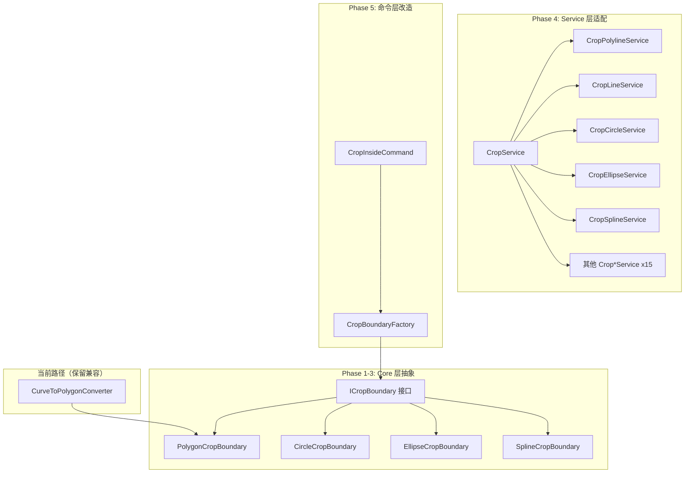

# 裁剪边界架构重构方案

## 1. 问题分析

### 当前架构

```
┌─────────────────────────────────────────────────────────────┐
│                    CropInsideCommand                         │
│  SelectBoundaryPolyline()                                    │
│    └─ CurveToPolygonConverter.ConvertCurveToPolygon(curve)   │
│         ├─ Polyline → 直接取顶点                             │
│         ├─ Circle   → 采样64段折线                           │
│         ├─ Ellipse  → 采样128段折线  ← 精度损失              │
│         └─ Spline   → 采样200段折线                          │
│    └─ 结果: List<Point2D> 多边形顶点                         │
│                                                              │
│  CropService.CropInside(input)                               │
│    └─ CropEntity(entity, polygonVertices)                    │
│         └─ ICropGeometryService (仅接受多边形)                │
│              ├─ IsPointInPolygon(point, polygon)             │
│              ├─ FindLineSegmentIntersections(seg, polygon)   │
│              └─ ClassifyBoundingBox(bbox, polygon)           │
└─────────────────────────────────────────────────────────────┘
```

### 核心问题

**所有边界类型都被强制转换为 `List<Point2D>` 多边形**，然后 Core 层的几何算法只接受多边形输入。这导致：

| 边界类型 | 精度损失 | 采样密度 |
|---------|---------|---------|
| Circle | 圆被64段折线近似，有弧弦误差 | 64段 |
| Ellipse | 椭圆被128段折线近似，旋转+弧弦误差 | 128段 |
| Spline | 200段折线近似，曲线误差 | 200段 |
| Polyline | 无损失（本身就是多边形） | N/A |

**工作量估计**：修正 `ICropGeometryService` 接受曲线边界将为所有边界类型消除采样误差，但涉及 Service 层所有 `Crop*Service` 的接口变更，约15个文件。

### 已存在的精确求交能力

当前代码中已经有精确的解析求交算法，但只用在了**被裁剪实体**侧的弧段处理：

- `GeometryHelper.LineCircleIntersection()` — 直线-圆解析求交
- `CropCircleService.LineCircleIntersection()` — 同上（重复实现）
- `CropPolylineService.ProcessArcSegmentExact()` — 圆-线段求交用于弧段拆分

## 2. 目标架构

```
┌──────────────────────────────────────────────────────────────────┐
│                        CropInsideCommand                         │
│  SelectBoundary()                                                │
│    └─ CropBoundaryFactory.Create(curve)                          │
│         ├─ Polyline  → PolygonCropBoundary(polygon)              │
│         ├─ Circle    → CircleCropBoundary(center, radius)        │
│         ├─ Ellipse   → EllipseCropBoundary(center, major, minor) │
│         └─ Spline    → SplineCropBoundary(sampledPolygon)        │
│                                                                  │
│  CropService.CropInside(input)                                   │
│    └─ CropEntity(entity, IBoundary)                              │
│         └─ IBoundary (抽象接口)                                   │
│              ├─ IsPointInside(point) → bool                      │
│              ├─ FindIntersections(seg) → List<Point2D>           │
│              ├─ ClassifyBoundingBox(bbox) → ContainmentResult    │
│              └─ GetApproxPolygon() → IReadOnlyList<Point2D>      │
└──────────────────────────────────────────────────────────────────┘
```

### 新增类型

#### 2.1 `ICropBoundary` 接口（Core 层）

```csharp
// src/DDNCadAddins.Core/Interfaces/ICropBoundary.cs
public interface ICropBoundary
{
    /// <summary>判断点是否在边界内部（含边界线）.</summary>
    bool IsPointInside(Point2D point);

    /// <summary>计算线段与边界的所有交点，按距离起点排序.</summary>
    List<Point2D> FindLineIntersections(Point2D segStart, Point2D segEnd);

    /// <summary>快速包围盒分类.</summary>
    ContainmentResult ClassifyBoundingBox(Point2D minPoint, Point2D maxPoint);

    /// <summary>包围盒最小值.</summary>
    Point2D BoundingBoxMin { get; }

    /// <summary>包围盒最大值.</summary>
    Point2D BoundingBoxMax { get; }

    /// <summary>获取近似多边形（用于兜底/兼容场景）.</summary>
    IReadOnlyList<Point2D> GetApproximatePolygon();
}
```

#### 2.2 实现类

| 类名 | 位置 | 精确方法 | 说明 |
|------|------|---------|------|
| `PolygonCropBoundary` | Core 层 | 多边形射线法 + 线段求交 | 从现有 `CropGeometryService` 迁移 |
| `CircleCropBoundary` | ServiceACAD 层 | 点-圆距离 + 直线-圆解析求交 | 零精度损失 |
| `EllipseCropBoundary` | ServiceACAD 层 | 点-椭圆隐式方程 + 直线-椭圆解析求交 | 零精度损失 |
| `SplineCropBoundary` | ServiceACAD 层 | 采样多边形代理 | 封闭样条线无解析解，保持采样 |

#### 2.3 `CropBoundaryFactory` 工厂

```csharp
// src/ServiceACAD/CropBoundaryFactory.cs
public static class CropBoundaryFactory
{
    public static ICropBoundary CreateFromCurve(Curve curve) { ... }
}
```

## 3. 接口变更

### 3.1 删除/替换的接口

`ICropGeometryService` 将逐步被 `ICropBoundary` 替代。但为了兼容性，第一阶段保留 `ICropGeometryService` 作为 `PolygonCropBoundary` 的内部实现。

### 3.2 变更的 Service 签名

所有 `Crop*Service` 的方法签名从：

```csharp
// 当前
OpResult<CropXxxResult> CropXxxInside(
    IReadOnlyList<CorePoint2D> bp,  // ← 多边形顶点
    List<ObjectId> ids,
    ITransactionService ts);
```

改为：

```csharp
// 第一阶段 — 重载兼容
OpResult<CropXxxResult> CropXxxInside(
    IReadOnlyList<CorePoint2D> bp,       // 保留旧接口
    List<ObjectId> ids,
    ITransactionService ts);

OpResult<CropXxxResult> CropXxxInside(
    ICropBoundary boundary,              // 新增新接口
    List<ObjectId> ids,
    ITransactionService ts);

// 第二阶段 — 删除旧接口，全部使用 ICropBoundary
// （内部实现：新接口 > 旧接口，旧接口适配为 new PolygonCropBoundary(bp)）
```

### 3.3 受影响的文件

| 文件 | 变更类型 |
|------|---------|
| `src/DDNCadAddins.Core/Interfaces/ICropGeometryService.cs` | 保留，作为 `PolygonCropBoundary` 内部实现 |
| `src/DDNCadAddins.Core/Interfaces/ICropBoundary.cs` | **新增** |
| `src/DDNCadAddins.Core/Models/ContainmentResult.cs` | 不变 |
| `src/DDNCadAddins.Core/Services/CropGeometryService.cs` | 保留，作为内部实现 |
| `src/ServiceACAD/CropBoundaryFactory.cs` | **新增** |
| `src/ServiceACAD/CropBoundary/PolygonCropBoundary.cs` | **新增**（Core层） |
| `src/ServiceACAD/CropBoundary/CircleCropBoundary.cs` | **新增** |
| `src/ServiceACAD/CropBoundary/EllipseCropBoundary.cs` | **新增** |
| `src/ServiceACAD/CropBoundary/SplineCropBoundary.cs` | **新增** |
| `src/ServiceACAD/CropService.cs` | 修改 |
| `src/ServiceACAD/CropPolylineService.cs` | 修改 |
| `src/ServiceACAD/CropLineService.cs` | 修改 |
| `src/ServiceACAD/CropCircleService.cs` | 修改 |
| `src/ServiceACAD/CropArcService.cs` | 修改 |
| `src/ServiceACAD/CropEllipseService.cs` | 修改 |
| `src/ServiceACAD/CropSplineService.cs` | 修改 |
| `src/ServiceACAD/Crop3DPolylineService.cs` | 修改 |
| `src/ServiceACAD/CropMLineService.cs` | 修改 |
| `src/ServiceACAD/CropLeaderService.cs` | 修改 |
| `src/ServiceACAD/CropHatchService.cs` | 修改 |
| `src/ServiceACAD/CropBlockService.cs` | 修改 |
| `src/ServiceACAD/CropTextService.cs` | 修改 |
| `src/ServiceACAD/CropMTextService.cs` | 修改 |
| `src/ServiceACAD/CropDimService.cs` | 修改 |
| `src/ServiceACAD/CropPointService.cs` | 修改 |
| `src/ServiceACAD/CropSolidService.cs` | 修改 |
| `src/ServiceACAD/CropUtils.cs` | 修改 |
| `src/ServiceACAD/CurveToPolygonConverter.cs` | 保留，用于 `SplineCropBoundary` |
| `src/ServiceACAD/GeometryHelper.cs` | 扩展：添加 `LineEllipseIntersection` |
| `src/AddinsACAD/Commands/CropInsideCommand.cs` | 修改 |
| `src/DDNCadAddins.Core.Tests/CropGeometryServiceTests.cs` | 扩展：添加 `ICropBoundary` 测试 |

## 4. 分阶段实施计划

### Phase 1：Core 层抽象 + 基础实现

**目标**：新 `ICropBoundary` 接口 + `PolygonCropBoundary`

**文件**：
1. 新增 `ICropBoundary` 接口
2. 新增 `PolygonCropBoundary` 类（从 `CropGeometryService` 提取逻辑）
3. 保留 `ICropGeometryService` 作为兼容层

**验证**：所有现有 260 测试通过

### Phase 2：精确圆边界实现

**目标**：`CircleCropBoundary` — 零精度损失

**文件**：
1. 新增 `CircleCropBoundary`（Core 层，纯数学）
2. `GeometryHelper.LineCircleIntersection` 迁移到 Core 层
3. 新增 `CropBoundaryFactory.CreateFromCircle`

**验证**：`IsPointInside` 精确到 `1e-12`，线段求交零误差

### Phase 3：精确椭圆边界实现

**目标**：`EllipseCropBoundary` — 零精度损失

**文件**：
1. 新增 `EllipseCropBoundary`（Core 层，纯数学）
2. 用椭圆隐式方程 `Ax² + Bxy + Cy² + Dx + Ey + F = 0` 实现点含判断
3. 用直线-椭圆二次方程解析求交
4. 新增 `CropBoundaryFactory.CreateFromEllipse`

**验证**：`IsPointInside` 精确到 `1e-12`，线段求交零误差

### Phase 4：Service 层适配

**目标**：所有 `Crop*Service` 支持 `ICropBoundary`

**策略**：
1. 每个 `Crop*Service` 增加 `ICropBoundary` 重载
2. 旧 `IReadOnlyList<Point2D>` 方法适配为 `new PolygonCropBoundary(bp)`
3. 逐步弃用旧方法

### Phase 5：CropInsideCommand 改造

**目标**：`SelectBoundary` 直接返回 `ICropBoundary`

**文件**：
1. `CropInsideCommand.SelectBoundaryCurve()` 替代 `SelectBoundaryPolyline()`
2. 调用 `CropBoundaryFactory.CreateFromCurve(curve)` 替代 `ConvertCurveToPolygon`

## 5. Mermaid 架构图



## 6. 关键设计决策

### 6.1 为什么 `ICropBoundary` 放在 Core 层？

`ICropBoundary` 是纯数学接口，无 AutoCAD 依赖。`Point2D` 已经在 Core 层。`CircleCropBoundary` 和 `EllipseCropBoundary` 的实现仅需数学运算，也应放在 Core 层。

### 6.2 为什么 `SplineCropBoundary` 保留采样？

封闭样条线（Spline）没有封闭形式的解析解。NURBS 求交需要迭代算法，复杂度高。采样折线是合理折中。但通过 `ICropBoundary` 封装，调用方无需感知差异。

### 6.3 为什么保留 `ICropGeometryService`？

`ICropGeometryService` 被 `TestRecorder.CollectSnapshots` 和其他测试基础设施使用。保留它作为 `PolygonCropBoundary` 的内部实现，避免大规模测试重构。

### 6.4 向后兼容策略

第一阶段所有 `Crop*Service` 增加 `ICropBoundary` 重载，旧方法签名保留并适配：

```csharp
// 旧方法（兼容）
public OpResult<CropXxxResult> CropXxxInside(
    IReadOnlyList<CorePoint2D> bp, List<ObjectId> ids, ITransactionService ts)
{
    return this.CropXxxInside(new PolygonCropBoundary(bp), ids, ts);
}
```

## 7. 工作量估算

| 阶段 | 内容 | 新增文件 | 修改文件 | 影响测试 |
|------|------|---------|---------|---------|
| 1 | ICropBoundary + PolygonCropBoundary | 2 | 0 | 0 |
| 2 | CircleCropBoundary | 1 | 1 (GeometryHelper) | 新增3-5 |
| 3 | EllipseCropBoundary | 1 | 0 | 新增3-5 |
| 4 | Service 层适配 | 0 | ~15 | 0 |
| 5 | 命令层改造 | 1 | 2 | 0 |
| **合计** | | **5** | **~18** | **新增6-10** |